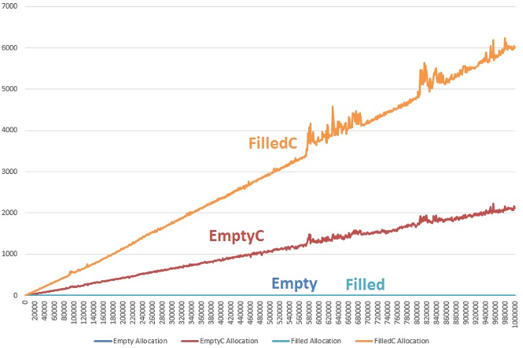
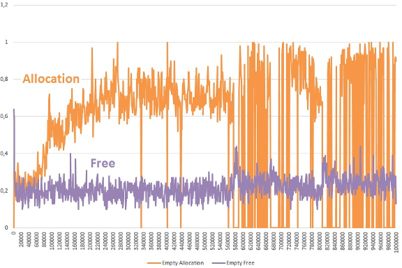
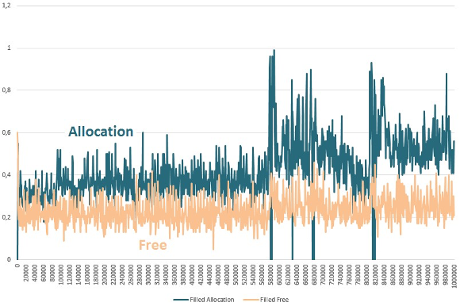
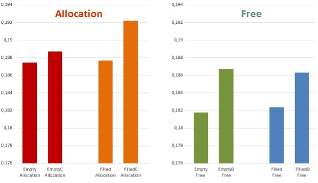

# Measuring the creation and deletion times of objects with constructors, destructors and without them
## Types
The following data types were created:

* `Empty` (empty class)
* `EmptyC` (empty class with empty constructor);
* `EmptyD` (empty class with empty destructor);
* `EmptyCD` (empty class with empty constructor and destructor).
* `Filled` (filled class without constructor and destructor);
* `FilledC` (filled class with constructor, no destructor);
* `FilledD` (filled class with destructor, no constructor);
* `FilledCD` (filled class with constructor and destructor).

The filled classes differ from the empty ones in that they contain 5 `int` fields. Classes are declared in [classes/core.h](classes/core.h).

## Time measurement
A template class `Tester<T>` ([classes/tester.h](classes/tester.h)) has been created, which measures the time of creation/destruction of objects of the type `T` passed to the template. Since the time for creating and deleting one instance is very small, the class measures the time for allocating and initializing an array of several elements class `T`. Time is measured in ticks.

`Tester<T>` contains three methods:

* `clock_t AllocateTest (int count);` returns the time of memory allocation, initialization of an array of count elements of class `T`, if `count <= 0`, returns `0`
* `clock_t FreeTest ();` returns the time of destroying objects and freeing memory from an array, if no memory for the array was previously allocated, `0` is returned
* `bool IsFilled ();` checks if an array is full

## Test implementation
Everything that will be said in this section is declared and implemented in a separate module([tests.h](tests.h), [tests.cpp](tests.cpp)).

We will test all the types we have created, so I created a `MemoryTestResult` structure that contains the time information for each type. Another structure `TestResult` stores information about allocating and freeing memory using the previous structure. For the latter, the operator `<<` is redefined, so it can be easily and beautifully output to the output.

Functions:

* `TestResult test (int count)` returns the test result for an array of `count`.
* `TestResult test (int count, int testCount)` runs `testCount` tests on an array of size `count`, returns the average arithmetic of all tests
* `void testToFileForExcel (std :: ostream & stream, int lowerCountBorder, int hightCountBorder, int step, int testsCount = 1)` in order to visually see how the allocation and release times behave depending on the size of the elements, a function has been created that outputs information to the output in a more or less structured, less readable form, but in such a way that it can be easily copy from text and paste into excel spreadsheet to build a graph. does a lot of tests, with element counts ranging from lowerCountBorder to hightCountBorder with step step. for the same array size, conducts testCount of tests and writes the arithmetic mean to the corresponding size
* `void testToFileForExcel (const char * fileName, int lowerCountBorder, int hightCountBorder, int step, int testsCount = 1)` wrapper over the previous method to write data to a file

## Test results
Tests were performed for arrays of size from 1 to 1,000,000 with a step of 1000, the number of tests for the same size - 100 (calls `testToFileForExcel ("output.txt", 0, 1000000, 1000,100)`).

Experiments have shown that the time for deleting objects does not depend on the presence of a constructor in them, and the time of creation does not depend on the presence of a destructor. Therefore, the article will not show some experiments on the corresponding classes (for example, creating an `EmptyD`, `FilledCD`).

Let's start with the pictures. Horizontally - the size of the array, vertically - the average number of ticks from 100 tests.

### Memory allocation

### Freeing up memory

The graphs show that the time for allocating/freeing objects with constructors/destructors is linear, but without them it is constant (blue horizontal line at the bottom of the graphs). In addition, emptying `EmptyD` and `FilledD` is almost the same regardless of the size of the array.

The time for creating/deleting `Empty` and `Filled` is constant. Let's take a closer look at their graphs.

### Allocating and freeing `Empty`

### Allocating and freeing `Filled`

As it turned out, in practice, the creation time of objects is slightly longer than the release time, and this is true both for objects with constructors/destructors and for objects without them.

It should be noted that in the region of 570 - 700 and 800 - 850 thousand ALL charts behave in a strange way. I think we can say that the placement of these two "strange" ranges does not depend on the size of the allocated memory, but only on the size of the array, since this behavior is typical for `Empty` (1 byte) and `Filled` (20 bytes). Perhaps this is due to the optimization of allocating large chunks of memory in the heap.

Since the time with additional constructors is linear, and without it is constant, let's compare tests for size 1. The execution time is very small, so let's take the average of 1,000,000 tests.

As you can see, in this case, creating instances of classes without an empty constructor, and deleting them without an empty destructor is not much, but still less than with them.

## Conclusion
Thus, if a constructor in a program is used only for "manual" initialization of fields, or if it does nothing at all, then it is better to remove it from the class. A similar situation is with destructors, which do nothing.
